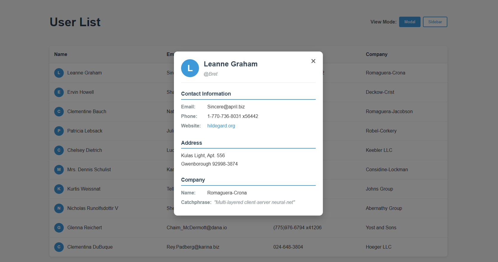
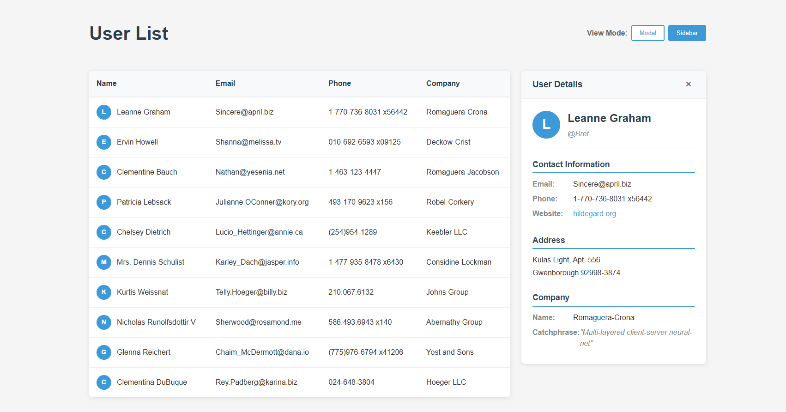

# React-Data-Fetching-and-Display
This is  a simple React Data Fetching and Display app.




## Features

- 📝 **List of Users**: App lists userdata fetched from JSONPlaceholder
- 🔍 **User Info**: App shows user info on each row.
- ❎ **User Details**: On click of certain row the info about the user inside is shown as Modal card or as a card on the right side of table.
- 🧮 **Choice of Displaying Details**: User is free to choose the way he sees the details.


## Technologies Used

- Vite
- React
- TypeScript + SWC
- Axios

## Dependencies
- react 
- react-dom 
- axios 

## Dev-Dependencies

- @eslint/js 
- @types/react 
- @types/react-dom 
- @vitejs/plugin-react-swc 
- eslint 
- eslint-plugin-react-hooks 
- eslint-plugin-react-refresh 
- globals 
- typescript 
- typescript-eslint 
- vite 

### Other Tools

- Git/GitHub

## Installation

1. Clone the repository:
   ```bash
   git clone https://github.com/superGemHere/React-Data-Fetching-and-Display
   ```
2. Navigate to client folder:
   ```bash
   cd ./client
   ```
3. Install dependencies:
   ```bash
   npm install
   ```
4. Run the server with npm or pnpm:
   ```bash
   npm run dev / pnpm dev
   ```
